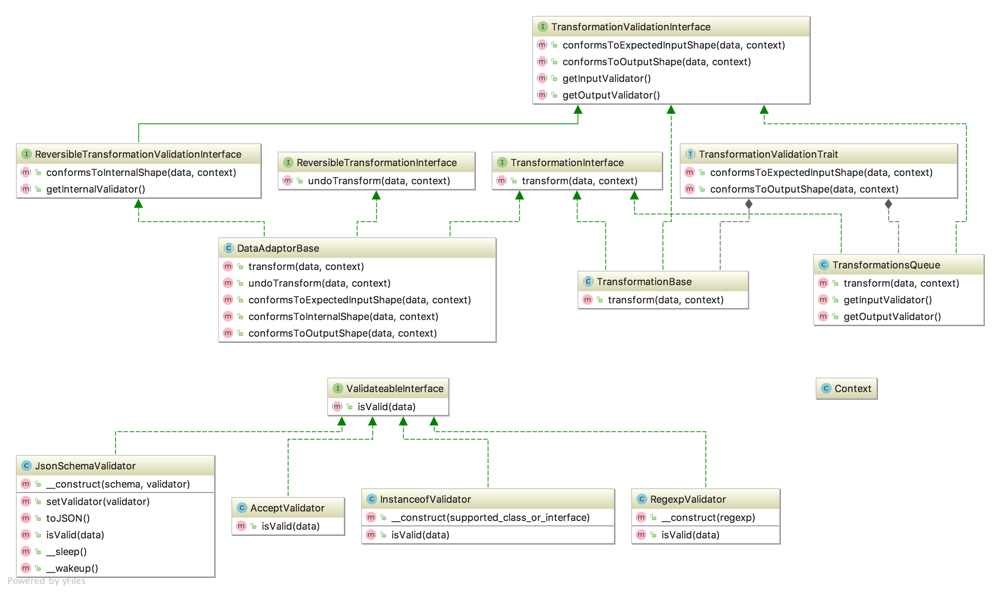

[](https://coveralls.io/github/e0ipso/shaper?branch=master) [](https://travis-ci.org/e0ipso/shaper)

# Shaper

Shaper is a simple library that enables type safe data transformations. You can either have simple
transformations or queued transformations.

## One-way Transformations

One way transformations are useful when data only flows in one direction. An example of this is a
read-only HTTP API that based on the contents of one property in the output will make a request to
an external service to include extra data in the original response.

### Simple Transformations

Performs a single operation to transform the data in a type safe manner.

```php
use JsonSchema\Validator;
use Shaper\Transformation\TransformationBase;
use Shaper\Util\Context;
use Shaper\Validator\JsonSchemaValidator;


class NumberToArray extends TransformationBase {
  public function getInputValidator() {
    return new JsonSchemaValidator(['type' => 'number'], new Validator());
  }
  public function getOutputValidator() {
    $schema = ['type' => 'array', 'items' => ['type' => 'number']];
    return new JsonSchemaValidator($schema, new Validator());
  }
  protected function doTransform($data, Context $context) {
    return [$context['keyName'] => $data];
  }
}

$t = new NumberToArray();
$t->transform(42, new Context(['keyName' => 'data'])); // ['data' => 42]
$t->transform(['foo']); // TypeError exception.
```

### Queued Transformations

Performs a set of operations, one after the other in a type safe manner.

```php
use JsonSchema\Validator;
use Shaper\Transformation\TransformationBase;
use Shaper\Util\Context;
use Shaper\Validator\InstanceofValidator;
use Shaper\Validator\JsonSchemaValidator;
use Shaper\Transformation\TransformationsQueue;

class ObjectToNumber extends TransformationBase {
  public function getInputValidator() {
    return new InstanceofValidator(\stdClass::class);
  }
  public function getOutputValidator() {
    $schema = ['type' => 'number'];
    return new JsonSchemaValidator($schema, new Validator());
  }
  protected function doTransform($data, Context $context) {
    return isset($data->value) ? $data->value : 0;
  }
}

$t = new TransformationsQueue();
$t->add(new ObjectToNumber());
$t->add(new NumberToArray());
$input = new \stdClass();
$input->value = 42;
$t->transform($input, new Context(['keyName' => 'data'])); // ['data' => 42]
```

## Two-way Transformations (aka Data Adaptor)

Data adaptors, or reversible transformations, are useful when the data can flow in both directions.
An example of this is an HTTP API that exposes an internal storage. However the internal storage
format is not the format that the API wants to expose. For that data coming in needs to be
transformed into the internal storage format, and data coming out needs to be transformed into the
shape we want to expose to the outside world via our API.

```php
use JsonSchema\Validator;
use Shaper\DataAdaptor\DataAdaptorBase;
use Shaper\Util\Context;
use Shaper\Validator\InstanceofValidator;
use Shaper\Validator\JsonSchemaValidator;

class MyDataAdaptor extends DataAdaptorBase {
  protected function doTransform($data, Context $context) {
    return $data->{$context['keyName']};
  }
  protected function doUndoTransform($data, Context $context) {
    return (object) [$context['keyName'] => $data, 'bar' => 'default'];
  }
  public function getInputValidator() {
    // In a real world scenario we would describe this as a JSON Schema.
    return new InstanceofValidator(\stdClass::class);
  }
  public function getInternalValidator() {
    // In a real world this would be your internal data object. Something like cheking that this is
    // an object of class FieldItemInstance.
    return new JsonSchemaValidator(['type' => 'string'], new Validator());
  }
  public function getOutputValidator() {
    // In a real world scenario we would describe this as a JSON Schema. In most cases the output
    // validator is the same as the input validator, so you can return the input validator here.
    return new InstanceofValidator(\stdClass::class);
  }
}

$da = new MyDataAdaptor();
$data = new \stdClass();
$data->lorem = 'caramba!';
$da->transform($data, new Context(['keyName' => 'lorem'])); // 'caramba!'
$da->transform(new NodeObject()); // TypeError exception.
$da->undoTransform('caramba!', new Context(['keyName' => 'lorem'])); // (object) ['lorem' => 'caramba!', 'bar' => 'default']
$da->undoTransform([]); // TypeError exception.
```
 
## Class Diagram

